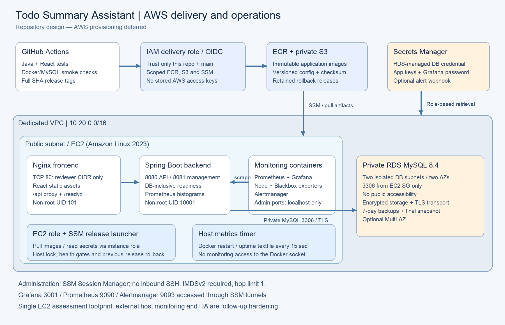

# AWS setup: EC2, private RDS and automated releases

These are provisioning instructions, not evidence of a live deployment. AWS setup is intentionally deferred for this submission. Once the one-time setup is complete, a successful `main` push builds, tests, publishes and deploys automatically.

## Network and security



Terraform creates a dedicated `10.20.0.0/16` VPC. EC2 runs in one public subnet with an Internet Gateway route, an Elastic IP and an encrypted 30 GB EBS volume. Two isolated private subnets in different availability zones form the RDS subnet group; neither has an Internet Gateway/NAT route. RDS MySQL 8.4 has encrypted storage, seven-day automated backups, a final deletion snapshot, deletion protection and a managed Secrets Manager password. Multi-AZ is selectable, but off for the smaller assessment footprint.

| Security group | Inbound | Outbound |
| --- | --- | --- |
| EC2 | TCP 80 only from `allowed_http_cidr` | HTTPS 443 for ECR, S3, SSM, registries, updates and integrations; MySQL 3306 to the RDS SG |
| RDS | TCP 3306 only from the EC2 SG | No explicit outbound rule; return traffic is stateful |

No SSH port is opened; use SSM Session Manager and Run Command. Ports 8080, 8081, 9100 and 9115 are not published by Docker. Grafana 3001, Prometheus 9090 and Alertmanager 9093 bind to localhost. Security groups still protect the host even when Docker creates its own forwarding rules. DNS to the VPC resolver is handled by the VPC. RDS `require_secure_transport` is enabled and the JDBC connection uses encrypted transport.

The application has no authentication upstream. Restrict HTTP to your current public IP (`/32`) or a trusted review network. Terraform rejects a world-open CIDR. An actual public production service should add HTTPS, authentication and an ALB rather than widening this assessment endpoint.

## IAM and secret handling

The EC2 instance profile permits SSM agent operations, pulling only the two ECR repositories, reading release objects under the one S3 prefix, and retrieving only the two designated secrets. AWS-required authorization calls use wildcard resources; repository, object, secret and deploy-target operations are scoped. Instance metadata requires IMDSv2 with a hop limit of one. Host scripts use the role, while application containers receive only their application configuration.

GitHub assumes a separate IAM role through OIDC, restricted to `repo:Chandu378/TodoSummaryAssistant-DevOps:ref:refs/heads/main` and the STS audience. The role can publish to the two ECR repositories, upload/read release objects, invoke only the custom deploy document on this instance and poll command results. It cannot retrieve database/application secrets or provision infrastructure. There are no long-lived AWS access keys in GitHub or the repository. Keep the deploy job free of a GitHub `environment:` field unless you also change the OIDC subject restriction for that environment.

Terraform manages the **metadata** of the application secret and the RDS-managed master secret, not their plaintext contents. Runtime scripts fetch the values into root-owned `deploy/runtime/` files, never print them, and preserve special characters using raw Compose env files. Monitoring only receives its own password/webhook files. Access to the Docker daemon and root remains privileged and must be restricted. Terraform state contains resource identifiers and must still be protected even though no managed password value is stored in it.

## One-time provisioning

Prerequisites: Terraform >=1.6 (the workflow uses 1.10.5), AWS CLI v2, GitHub CLI, an AWS account/session authorized to create these resources, and a region supporting the selected MySQL/instance classes. Authenticate with AWS SSO or an administrator's temporary role session. These privileges are separate from the narrow delivery role.

```bash
aws sso login --profile YOUR_PROFILE
export AWS_PROFILE=YOUR_PROFILE
aws sts get-caller-identity
cd aws/iac
cp terraform.tfvars.example terraform.tfvars
# Edit allowed_http_cidr and region. Never add passwords to tfvars.
terraform init
terraform plan -out=setup.tfplan
terraform apply setup.tfplan
terraform output
```

If your account already has the GitHub OIDC provider, set `existing_github_oidc_provider_arn` to reuse it. Commit the generated `.terraform.lock.hcl` when updating dependencies. Local state is ignored; for team use, configure an encrypted private S3 backend with state locking before applying. No CI job runs `terraform apply`.

The latest Amazon Linux 2023 x86_64 AMI is resolved from the public AWS SSM parameter. User-data installs Docker, AWS CLI, Python and a fixed/checksummed Compose plugin. It writes `/etc/todo/config.json` containing non-secret resource references, installs the locked `/usr/local/bin/todo-release` launcher and enables `todo-metrics.timer`. The deployment document waits for cloud-init to finish before starting a release. Review bootstrap errors in `/var/log/cloud-init-output.log` through SSM if the first release fails.

## Populate the application secret

Use the AWS Secrets Manager console to fill the secret ARN from `terraform output app_secret_arn`, or prepare a file outside the repository with the shape in [app-secret.example.json](app-secret.example.json):

| JSON key | Required / purpose |
| --- | --- |
| `cohere_api_key` | Key present; actual credential needed for summarization |
| `slack_webhook_url` | Key present; actual webhook needed for posting summaries |
| `grafana_admin_password` | Random password of at least 16 characters |
| `alert_slack_webhook_url` | Optional dedicated operations webhook; empty means alerts remain visible without external notification |

```bash
# Replace this example path with your protected file outside the checkout.
chmod 600 /private/tmp/todo-app-secret.json
aws secretsmanager put-secret-value \
  --secret-id YOUR_APP_SECRET_ARN \
  --secret-string file:///private/tmp/todo-app-secret.json \
  --region ap-south-1
```

Do not put literal passwords or keys in command arguments/history. Use a dedicated channel/webhook for operational notifications if enabling them. The example JSON contains placeholders only; do not deploy those placeholders as real integration credentials. The managed RDS secret needs no manual password creation. Secret rotation requires a redeployment to refresh backend configuration; Grafana initializes its admin password only on its first database creation, so rotate an existing account through Grafana's account settings as well.

For the assessment, the backend uses the RDS-managed master user to preserve Hibernate schema creation. For a broader production service, create a dedicated user limited to the `todo` schema, use a separate app DB secret, and migrate the schema with a controlled migration role. Also import/trust the current RDS CA bundle and use `sslMode=VERIFY_IDENTITY` before treating transport as fully authenticated.

## Enable GitHub delivery

`terraform output github_actions_variables` provides all non-secret settings:

| Repository variable | Source / purpose |
| --- | --- |
| `AWS_REGION` | Provisioned region |
| `AWS_DEPLOY_ROLE_ARN` | OIDC delivery role |
| `EC2_INSTANCE_ID` | SSM deployment target |
| `DEPLOY_DOCUMENT` | Custom SHA-only SSM document |
| `ECR_REGISTRY` | Account/region registry hostname |
| `BACKEND_REPOSITORY`, `FRONTEND_REPOSITORY` | Immutable application image repositories |
| `ARTIFACT_BUCKET` | Private/versioned release configuration storage |
| `AWS_DEPLOY_ENABLED` | Set to `true` after setup and secrets are ready |

With Terraform/GitHub CLI authenticated, run from the repository root:

```bash
python3 scripts/configure-github-vars.py
gh variable set AWS_DEPLOY_ENABLED --repo Chandu378/TodoSummaryAssistant-DevOps --body true
gh workflow run ci-cd.yml --repo Chandu378/TodoSummaryAssistant-DevOps --ref main
```

GitHub variables are appropriate for these non-secret identifiers. GitHub's ephemeral OIDC token and AWS Secrets Manager provide the secret stores. Enable branch protection requiring `validate` and `containers` before merging production changes. A normal `main` push now completes delivery without an approval/manual deployment step.

## Release and access verification

Release layout: `/opt/todo/releases/<full-sha>/`, with the last healthy version pointed to by `/opt/todo/current`. ECR tags are immutable SHAs; S3 stores the matching source configuration bundle and checksum. The launcher verifies the checksum, takes a host lock and runs the release script. The script validates config, pulls before modifying the stack, waits for container health and checks `/healthz`, `/readyz` and `/api/todos` through the frontend. A failed replacement restores the last healthy release, including its deployment/monitoring configuration and refreshed secrets. Compose persists named monitoring volumes; production has no MySQL container.

Verify the workflow result, then access `terraform output application_url` from the allowed CIDR. Confirm read/create/update/delete behavior manually with disposable data and configure integrations only when ready to send a real summary. Check SSM command output and the Grafana dashboard.

For Grafana, use a Session Manager tunnel (requires the AWS Session Manager plugin):

```bash
aws ssm start-session --target YOUR_INSTANCE_ID \
  --document-name AWS-StartPortForwardingSession \
  --parameters '{"portNumber":["3001"],"localPortNumber":["3001"]}' \
  --region ap-south-1
```

Open `http://localhost:3001`. Use the same document with port 9090/9093 to inspect Prometheus/Alertmanager. Your operator IAM session needs Session Manager permissions; the CI role intentionally cannot open sessions.

## Assumptions, costs and cleanup

This is one EC2 instance, not an autoscaling/zero-downtime deployment. Monitoring volumes live on its EBS disk; losing that disk loses metrics history but not RDS application data. No AWS resource or live failover has been tested by a local Terraform validation. After provisioning, perform a real deploy, rollback, reboot, alert and snapshot-restore drill before claiming operational readiness.

The default `t3.small` is chosen for the JVM plus monitoring memory budget; use `t3.medium` if load/metrics pressure requires it. Confirm regional support and pricing rather than assuming free-tier coverage. RDS Multi-AZ, public IPv4, EBS, snapshots and Secrets Manager can incur charges. Stopping EC2 alone does not stop all billing.

For cleanup, disable the GitHub deployment variable first, preserve any required data, set `db_deletion_protection=false` and apply that setting, then review `terraform destroy`. RDS requires a final snapshot; the fixed final snapshot name must be changed or the old snapshot intentionally removed before reusing it for another destroy. S3 versions and ECR images intentionally prevent silent resource deletion: remove only the disposable releases/images you no longer need, including S3 object versions, before completing destruction. Final snapshots remain billable until explicitly deleted. Application secrets have a seven-day recovery window. Do not delete production data to make a destroy command pass.

Reference behavior is documented by [GitHub OIDC on AWS](https://docs.github.com/en/actions/how-tos/secure-your-work/security-harden-deployments/oidc-in-aws), [SSM parameter interpolation](https://docs.aws.amazon.com/systems-manager/latest/userguide/documents-schemas-features.html), [Compose readiness ordering](https://docs.docker.com/compose/how-tos/startup-order) and [Spring Boot Actuator](https://docs.spring.io/spring-boot/reference/actuator/endpoints.html).
